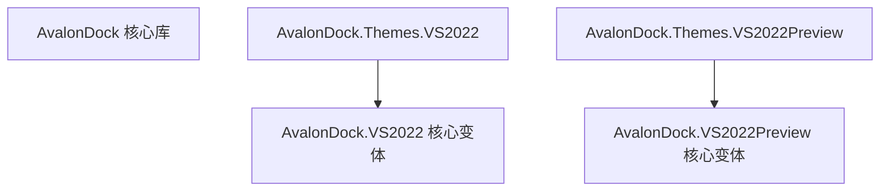
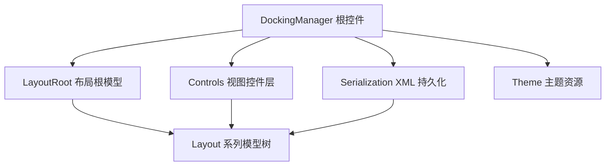
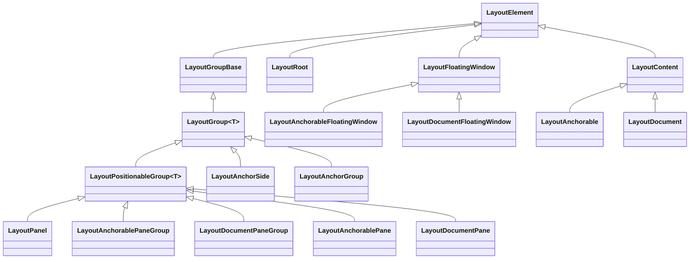
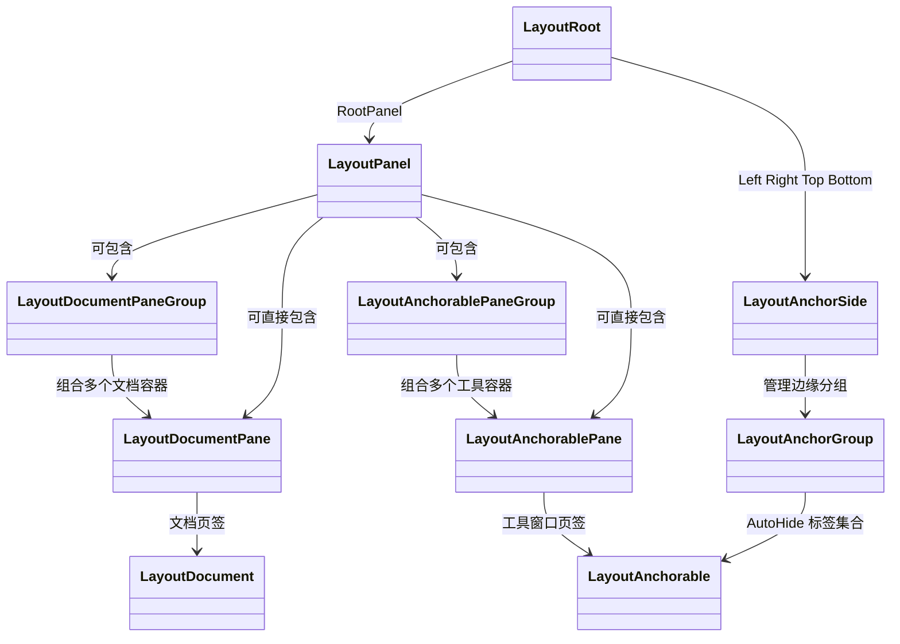
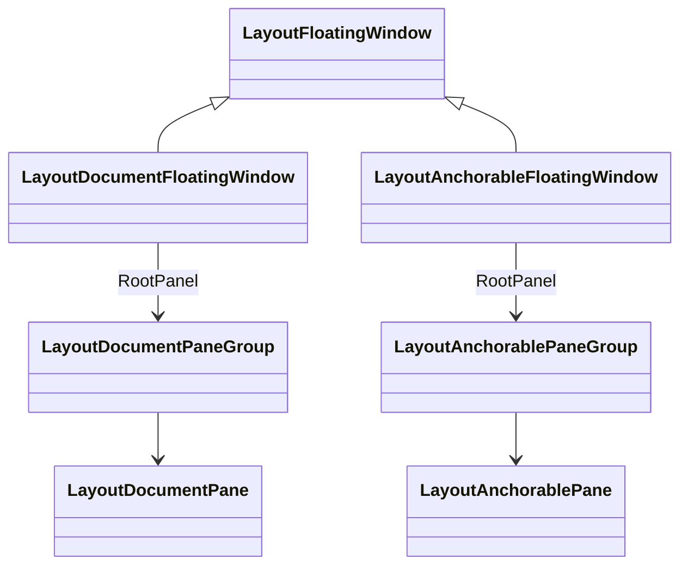
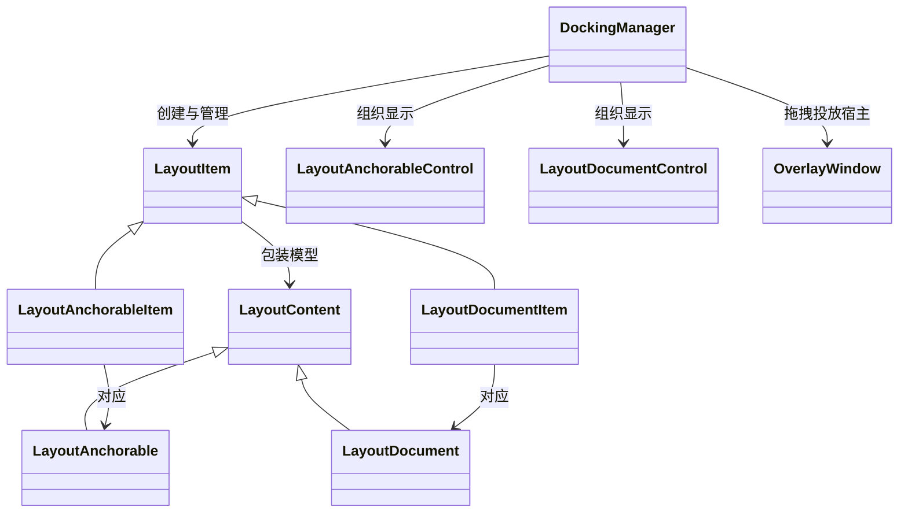
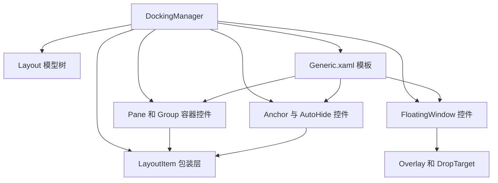
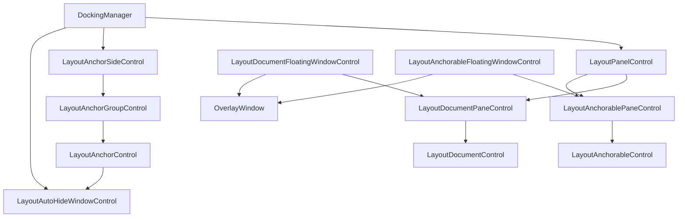

# AvalonDock 项目结构与类图梳理

本文档聚焦分析以下核心组件：

- `source/Components/AvalonDock`
- `source/Components/AvalonDock.VS2022`
- `source/Components/AvalonDock.Themes.VS2022`
- `source/Components/AvalonDock.VS2022Preview`
- `source/Components/AvalonDock.Themes.VS2022Preview`

目标是从项目结构、模块职责、核心类层次、运行关系几个角度，快速说明该仓库的主干设计。

---

## 1. 项目总览

从解决方案 `source/AvalonDock.sln` 可以看出，这个仓库并不只是一个单独控件，而是一组围绕 Docking 系统构建的组件集合，主要分为四类：

1. **核心停靠框架**  
   例如 `source/Components/AvalonDock`、`source/Components/AvalonDock.VS2022`、`source/Components/AvalonDock.VS2022Preview`

2. **主题组件**  
   例如 `source/Components/AvalonDock.Themes.VS2022`、`source/Components/AvalonDock.Themes.VS2022Preview`，以及 Aero、Metro、VS2013 等主题包

3. **示例与演示程序**  
   例如 `source/MVVMTestApp`、`source/VS2022Test`、`source/VS2022PreviewTest`、`source/CaliburnDockTestApp`

4. **测试与验证项目**  
   例如 `source/AutomationTest/AvalonDockTest`

对于本次分析范围，最重要的结论是：

- `AvalonDock` 是通用 WPF Docking 框架主实现
- `AvalonDock.VS2022` 与 `AvalonDock.VS2022Preview` 是面向 VS2022 风格演进出来的独立变体实现
- `AvalonDock.Themes.VS2022` 与 `AvalonDock.Themes.VS2022Preview` 则分别给对应变体提供主题资源与主题入口类

---

## 2. 目录结构说明

### 2.1 核心目录分层

```text
source/
└─ Components/
   ├─ AvalonDock/
   │  ├─ Layout/                 # 布局模型树，描述文档窗格、工具窗格、浮动窗格等
   │  ├─ Layout/Serialization/   # 布局序列化与反序列化
   │  ├─ Controls/               # 与 Layout 模型对应的可视控件层
   │  ├─ Commands/               # 命令与弱引用委托
   │  ├─ Converters/             # XAML 绑定转换器
   │  ├─ Themes/                 # 默认主题基类与通用资源
   │  └─ DockingManager.cs       # 框架根控件
   │
   ├─ AvalonDock.VS2022/         # VS2022 版本主实现，结构基本平行于 AvalonDock
   ├─ AvalonDock.Themes.VS2022/  # VS2022 主题资源包，依赖 AvalonDock.VS2022
   ├─ AvalonDock.VS2022Preview/  # VS2022 Preview 版本主实现
   └─ AvalonDock.Themes.VS2022Preview/
                              # VS2022 Preview 主题资源包，依赖 AvalonDock.VS2022Preview
```

### 2.2 核心库 `AvalonDock` 的内部职责

#### 1. Layout 模型层

`Layout` 目录是整个框架最关键的一层，它不是直接绘制 UI，而是先定义一棵**可序列化的布局树**。这棵树描述：

- 当前有哪些文档页
- 当前有哪些工具窗口
- 工具窗口停靠在哪个边缘
- 是否存在浮动窗口
- 当前激活项、选中项、隐藏项分别是谁

这意味着 AvalonDock 的核心思想是：

**先维护布局模型，再由控件层把模型投影为 UI。**

#### 2. Controls 视图层

`Controls` 目录中的类负责把 `Layout` 模型渲染成实际 WPF 控件，并处理：

- 拖拽停靠
- Tab 显示
- 浮动窗口
- AutoHide 展开/收起
- Overlay 命中测试与投放目标

它相当于布局模型的 UI 适配器层。

#### 3. Serialization 持久化层

`Layout/Serialization` 负责把布局树写成 XML，或从 XML 恢复布局，再把历史内容对象重新绑定回模型。

这也是 AvalonDock 能保存 IDE 布局状态的关键。

#### 4. Themes 主题层

`Themes` 提供主题抽象与默认资源入口，外部主题包只需提供不同的 XAML 资源字典和对应的 `Theme` 子类，即可完成整体换肤。

---

## 3. 组件依赖关系

下面这张图描述本次分析范围内几个核心组件之间的依赖关系。



### 3.1 关系解释

1. `source/Components/AvalonDock` 是传统主线核心库，包信息显示其定位是通用 WPF Docking 系统。
2. `source/Components/AvalonDock.VS2022` 是另一条并行核心线，包标识为 `ML592.AvalonDock`，目录结构几乎复制了主线核心库。
3. `source/Components/AvalonDock.Themes.VS2022` 的项目引用直接依赖 `source/Components/AvalonDock.VS2022/AvalonDock.VS2022.csproj`。
4. `source/Components/AvalonDock.Themes.VS2022Preview` 的项目引用直接依赖 `source/Components/AvalonDock.VS2022Preview/AvalonDock.VS2022Preview.csproj`。

换句话说：

- **主题包不直接实现 Docking 行为**
- **主题包只提供资源字典与主题入口类**
- **真正的停靠行为仍然由对应核心库承担**

---

## 4. 核心运行架构

AvalonDock 可以概括为一个四层结构：



### 4.1 运行流程说明

1. 应用把 `DockingManager` 放到窗口中作为根控件。
2. `DockingManager` 持有一个 `LayoutRoot`，它是完整布局树的入口。
3. `LayoutRoot` 再组织出文档区、工具窗口区、隐藏窗口、浮动窗口等模型对象。
4. `Controls` 层根据这些模型创建对应 UI 控件，并处理拖拽、停靠、显示和激活逻辑。
5. `Serialization` 层负责把当前模型树保存到 XML 或重新加载。
6. `Theme` 层通过资源字典切换视觉风格，但不改变布局模型本身。

---

## 5. 最重要的入口类：DockingManager

`DockingManager` 是整个框架的根控件，也是外部应用唯一必须直接接触的核心入口。

### 5.1 它负责什么

- 持有布局根对象 `Layout`
- 持有当前主题 `Theme`
- 管理浮动窗口集合
- 作为拖拽 Overlay 的宿主 `IOverlayWindowHost`
- 驱动模型层与控件层之间的装配

### 5.2 默认布局初始化

在构造函数中，`DockingManager` 会创建默认布局：

```csharp
Layout = new LayoutRoot
{
    RootPanel = new LayoutPanel
    {
        Children =
        {
            new LayoutDocumentPaneGroup
            {
                Children =
                {
                    new LayoutDocumentPane()
                }
            }
        }
    }
};
```

这说明即使用户不手动配置布局，框架也会自动生成一个最小可运行的文档区域。

### 5.3 为什么它是总调度中心

因为它同时连接：

- 布局模型树
- 可视控件树
- 拖拽命中与停靠区域
- 浮动窗口
- 主题资源
- 布局序列化

因此可以把 `DockingManager` 理解为：

**布局模型的宿主 + UI 渲染总入口 + 停靠交互调度器。**

---

## 6. Layout 模型层类图

下面是核心布局模型的主干继承结构。



---

## 7. 核心类职责说明

### 7.1 `LayoutElement`

这是几乎所有布局模型的抽象基类，核心职责是：

- 持有 `Parent`
- 通过 `Parent` 反向解析 `Root`
- 提供属性变更通知
- 在父子关系变化时触发布局更新

可以把它理解为布局树节点的统一根基类。

### 7.2 `LayoutGroupBase` 与 `LayoutGroup<T>`

`LayoutGroupBase` 是组节点抽象基类。  
`LayoutGroup<T>` 在此基础上真正提供：

- `Children` 子节点集合
- 插入、删除、替换、移动子节点的方法
- 基础 XML 读写能力
- 基于子节点可见性的组可见性计算

因此所有“容器型”布局节点，本质上都是某种 `LayoutGroup<T>`。

### 7.3 `LayoutPositionableGroup<T>`

它是容器节点的重要扩展层，为所有可定位容器引入：

- `DockWidth`
- `DockHeight`
- `DockMinWidth`
- `DockMinHeight`
- 浮动尺寸与位置
- 是否允许重复内容
- 是否允许重新排序

这意味着：

**只要某个布局组需要参与停靠尺寸计算、浮动尺寸计算、分割条调整，它通常会继承这一层。**

### 7.4 `LayoutRoot`

`LayoutRoot` 是整棵布局树的根，负责聚合：

- `RootPanel`
- `TopSide`
- `RightSide`
- `BottomSide`
- `LeftSide`
- `FloatingWindows`
- `Hidden`
- `ActiveContent`

它的职责不是绘制 UI，而是作为**完整布局状态的总容器**。

### 7.5 `LayoutPanel`

这是主工作区的组合面板，通常用于把：

- 文档区
- 停靠窗格区
- 水平或垂直拆分结构

拼接成一个大的布局面板。

它是 IDE 主区域骨架最常见的容器节点。

### 7.6 `LayoutContent`

这是 `LayoutAnchorable` 和 `LayoutDocument` 的共同父类，封装了几乎所有内容型节点共有的状态：

- `Title`
- `Content`
- `ContentId`
- `IsSelected`
- `IsActive`
- `PreviousContainer`
- 关闭与激活相关事件

从架构上看，它是“布局内容对象”的统一抽象。

### 7.7 `LayoutAnchorable`

表示工具窗口，例如：

- 资源管理器
- 属性面板
- 输出窗口
- 错误列表

它相比 `LayoutDocument` 额外支持：

- AutoHide
- Hide
- 停靠到边缘
- 作为标签文档停靠
- 记录自动隐藏尺寸

因此它更像 IDE 中可收起、可固定、可拖动到边缘的工具面板。

### 7.8 `LayoutDocument`

表示文档标签页。其特点是：

- 支持关闭
- 支持拖动换组
- 不能像工具窗口那样 Hide
- 通常位于中心文档区域

它代表 IDE 中最常见的编辑文档页签。

### 7.9 `Pane` 与 `PaneGroup` 系列

这一组类决定“内容到底放在哪里”，也是从抽象布局树走向具体停靠结构的关键中间层。相比前面的抽象基类，这一层开始体现 IDE 布局语义。

- `LayoutDocumentPane`：一个文档页签容器，直接持有多个 `LayoutContent`
- `LayoutAnchorablePane`：一个工具窗口页签容器，直接持有多个 `LayoutAnchorable`
- `LayoutDocumentPaneGroup`：多个文档容器的组合组，负责文档区再分组
- `LayoutAnchorablePaneGroup`：多个工具容器的组合组，负责工具窗区域再分组
- `LayoutAnchorSide`：布局根四边之一，负责管理一个边上的自动隐藏分组集合
- `LayoutAnchorGroup`：`AutoHide` 或边缘锚定组，负责把多个自动隐藏项组织在一起

可以把这组对象理解成两个层级：

1. **内容承载层**  
   `LayoutDocumentPane` 与 `LayoutAnchorablePane` 负责承载真正的内容页签

2. **区域编排层**  
   `LayoutDocumentPaneGroup`、`LayoutAnchorablePaneGroup`、`LayoutAnchorSide`、`LayoutAnchorGroup` 负责把多个内容承载层对象组合成最终布局拓扑



#### 7.9.1 `LayoutDocumentPane`

它是最核心的文档容器模型，通常位于中间主工作区。其职责不是绘制页签，而是维护：

- 当前文档集合
- 当前选中项
- 当前激活文档索引
- 文档容器尺寸与可见性

一个 `LayoutDocumentPane` 往往会映射到一个 `LayoutDocumentPaneControl`，由后者把它渲染为带标签栏的文档区域。

#### 7.9.2 `LayoutAnchorablePane`

它是工具窗口页签容器，和文档容器很像，但语义不同：

- 文档容器强调编辑区中心工作流
- 工具容器强调边缘辅助工作流

`LayoutAnchorablePane` 中的内容通常是资源管理器、输出、属性、工具箱等。它既可以固定停靠，也可以进入浮动状态，或者进一步进入 `AutoHide` 状态。

#### 7.9.3 `LayoutDocumentPaneGroup`

当一个文档区不再只有单一标签组，而是被拆成左右、上下多个文档区域时，底层就是 `LayoutDocumentPaneGroup` 在起作用。它负责：

- 组合多个文档 pane
- 决定横向还是纵向分组
- 参与尺寸分配与 `splitter` 行为

因此它更像是文档区内部骨架。

#### 7.9.4 `LayoutAnchorablePaneGroup`

它与 `LayoutDocumentPaneGroup` 类似，但面向的是工具窗口区域。比如左侧区域可能再被拆成上下两个 pane，底层通常就是 `LayoutAnchorablePaneGroup`。

它负责：

- 组合多个工具窗口容器
- 决定停靠组的方向
- 参与 `Grid` 尺寸分配

#### 7.9.5 `LayoutAnchorSide`

`LayoutAnchorSide` 不是普通 pane，它对应 `LayoutRoot` 的四个边：

- `Left`
- `Right`
- `Top`
- `Bottom`

它的作用不是直接放内容，而是作为 `AutoHide` 入口区域的组织者。边缘一排个签形式的自动隐藏标签，实际就是这一层模型在承载。

#### 7.9.6 `LayoutAnchorGroup`

`LayoutAnchorGroup` 是边缘自动隐藏系统的中间层。它承接 `LayoutAnchorSide`，再往下连接多个 `LayoutAnchorable`。也就是说：

- `LayoutAnchorSide` 决定边
- `LayoutAnchorGroup` 决定该边上的一组标签
- `LayoutAnchorable` 决定某个具体工具窗口

因此它本质上是 `AutoHide` 标签带的数据容器。

#### 7.9.7 这一组类的关系重点

最重要的不是单个类，而是它们组合出的规则：

- **Document** 通过 `LayoutDocumentPane` 进入中心文档工作区
- **Anchorable** 通过 `LayoutAnchorablePane` 进入工具窗口工作区
- **PaneGroup** 决定多个 pane 如何分组与拆分
- **AnchorSide + AnchorGroup** 决定 `AutoHide` 标签如何沿四边组织

换句话说，`Pane` 负责装内容，`PaneGroup` 负责编排容器，`AnchorSide` 负责边缘入口，三者共同决定 IDE 的整体结构。

### 7.10 `FloatingWindow` 系列

- `LayoutFloatingWindow`
- `LayoutDocumentFloatingWindow`
- `LayoutAnchorableFloatingWindow`

这组类用于表达被拖出主窗口后的浮动窗口模型。注意它们仍然属于布局树的一部分，而不是与布局模型完全分离的临时窗口。也就是说，浮动并不是脱离 `AvalonDock` 管理，而只是布局树中的另一种承载方式。



#### 7.10.1 `LayoutFloatingWindow`

这是所有浮动窗口模型的公共基类。它负责提供：

- 浮动窗口作为布局树节点的身份
- 与 `LayoutRoot.FloatingWindows` 的连接
- `XML` 序列化能力
- 公共窗口定位信息承载入口

它是浮动窗口抽象模型，但不关心里面装的是文档还是工具窗。

#### 7.10.2 `LayoutDocumentFloatingWindow`

它用于承载浮动文档区。一个被拖出主窗口的文档组，底层就会形成这种模型。它通常持有一个 `RootPanel`，而这个 `RootPanel` 往下还可能包含：

- 单个 `LayoutDocumentPane`
- 多个 `LayoutDocumentPane` 组成的 `LayoutDocumentPaneGroup`

这意味着一个浮动文档窗口内部依然可以是复杂文档布局，而不是只能容纳一个标签页。

#### 7.10.3 `LayoutAnchorableFloatingWindow`

它用于承载浮动工具窗区域。和文档浮动窗口不同，它通常持有的是工具窗 pane 或 pane group，并且与 `Hide`、`AutoHide`、`Dock` 回原位置等行为联系更紧密。

它在用户体验上更接近 `Visual Studio` 中被拖出来的工具窗口群。

#### 7.10.4 为什么浮动窗口仍属于布局树

这一点非常重要。因为只要仍在布局树中：

- 布局可以继续序列化
- 关闭与恢复行为可以回到原容器
- `ActiveContent` 仍能统一管理
- 拖拽回 `DockingManager` 时不需要额外构造外部状态

所以 `AvalonDock` 的浮动窗口不是独立系统，而是布局树的延伸分支。

---

## 8. Controls 控件层与模型层的映射关系

除了布局模型，`AvalonDock` 还有一套与之配对的控件层。最关键的一层是 `LayoutItem`，但真正让系统运转起来的是一整套从容器、标签、边缘、浮动窗口到拖拽投放的控件网络。



### 8.1 为什么 `LayoutItem` 很重要

`LayoutItem` 是一个典型的桥接层对象：

- 它持有 `LayoutContent`
- 它对外暴露 `Title`、`IconSource`、`IsSelected`、`IsActive` 等依赖属性
- 它把 UI 侧变化回写到模型侧

因此它是：

**模型对象与 WPF 可视元素之间的同步适配层。**

### 8.2 控件层的主要职责

`Controls` 目录整体承担以下工作：

- 根据模型生成文档项与工具项控件
- 管理拖拽目标与命中测试
- 生成 OverlayWindow 提示投放区域
- 管理 AutoHide 展开窗口
- 管理浮动窗体控制对象

换句话说，`Layout` 负责描述状态，`Controls` 负责把状态变成可交互界面。

### 8.3 `DockingManager` 如何把模型映射为控件

这一点在架构上非常关键。`DockingManager.CreateUIElementForModel` 会把不同模型实例映射为不同控件：

- `LayoutPanel` → `LayoutPanelControl`
- `LayoutAnchorablePaneGroup` → `LayoutAnchorablePaneGroupControl`
- `LayoutDocumentPaneGroup` → `LayoutDocumentPaneGroupControl`
- `LayoutAnchorSide` → `LayoutAnchorSideControl`
- `LayoutAnchorGroup` → `LayoutAnchorGroupControl`
- `LayoutDocumentPane` → `LayoutDocumentPaneControl`
- `LayoutAnchorablePane` → `LayoutAnchorablePaneControl`
- `LayoutAnchorableFloatingWindow` → `LayoutAnchorableFloatingWindowControl`
- `LayoutDocumentFloatingWindow` → `LayoutDocumentFloatingWindowControl`

因此 `DockingManager` 不是简单地持有布局对象，而是在运行期承担了一个 **模型到视图工厂** 的角色。

### 8.4 `Controls` 目录的核心分层

如果按职责把 `Controls` 目录再拆开，大致可以分为六组：

1. **内容包装层**  
   `LayoutItem`、`LayoutAnchorableItem`、`LayoutDocumentItem`

2. **内容显示层**  
   `LayoutAnchorableControl`、`LayoutDocumentControl`

3. **页签与容器层**  
   `LayoutAnchorablePaneControl`、`LayoutDocumentPaneControl`、`LayoutPanelControl`、`LayoutGridControl<T>`

4. **边缘与 AutoHide 层**  
   `LayoutAnchorSideControl`、`LayoutAnchorGroupControl`、`LayoutAnchorControl`、`LayoutAutoHideWindowControl`、`AutoHideWindowManager`

5. **浮动窗口层**  
   `LayoutFloatingWindowControl`、`LayoutAnchorableFloatingWindowControl`、`LayoutDocumentFloatingWindowControl`

6. **拖拽投放层**  
   `OverlayWindow`、`DragService`、`DropArea<T>`、各类 `DropTarget`



### 8.5 `LayoutItem` 包装层

这一层是 `MVVM` 与控件绑定最密集的部分。

#### 8.5.1 `LayoutItem`

`LayoutItem` 是所有内容项的统一包装对象，它不直接等于模型，也不直接等于显示控件，而是站在两者中间：

- 持有 `LayoutContent`
- 暴露标题、图标、选中、激活、关闭能力等依赖属性
- 提供 `View`，即真正承载内容的 `ContentPresenter`
- 提供默认命令，如关闭、浮动、激活、分组切换等

也就是说，`LayoutItem` 是 `UI` 命令面与模型状态面的汇合点。

#### 8.5.2 `LayoutDocumentItem`

`LayoutDocumentItem` 面向文档模型，额外强化了：

- `Description`
- 文档关闭命令
- 可见性变化向 `LayoutDocument.IsVisible` 回写

它的重点不是管理容器，而是把单个文档页的行为抽象成可绑定对象。

#### 8.5.3 `LayoutAnchorableItem`

`LayoutAnchorableItem` 比文档项更复杂，因为工具窗口比文档多了更多状态：

- `HideCommand`
- `AutoHideCommand`
- `DockCommand`
- `CanHide`
- `CanMove`

它实际上定义了一个工具窗口在标题栏和上下文菜单里可以做什么。

### 8.6 内容显示层

#### 8.6.1 `LayoutDocumentControl`

它是文档内容区域最内层的显示控件，模板非常薄，只负责承载 `LayoutItem.View`。也就是说，文档真正的内容视图最终是通过这个控件挂进可视树。

它的主要职责：

- 响应鼠标操作，把对应文档置为 `IsActive`
- 把 `LayoutDocument` 与可视宿主绑定起来
- 在文档内容级别维持焦点与激活同步

#### 8.6.2 `LayoutAnchorableControl`

它是工具窗口内容区域的最内层显示控件，但与文档不同，它通常自带一个标题区域 `AnchorablePaneTitle`。这也解释了为什么工具窗口看起来像一个带标题栏的小面板，而文档更像纯内容区域。

它的主要职责：

- 承载 `LayoutItem.View`
- 响应 `Model.IsEnabled` 变化
- 在获得键盘焦点时回写 `IsActive`
- 在模板中呈现工具窗口标题栏与内容区

### 8.7 容器与分组控件层

#### 8.7.1 `LayoutGridControl<T>`

这是最关键的容器基类之一。凡是需要用 `Grid` 组织多个子项并支持 `splitter` 调整尺寸的容器，基本都继承自它。

它负责：

- 根据模型子节点动态创建子控件
- 创建和更新行列定义
- 附加 `splitter`
- 把模型中的 `DockWidth`、`DockHeight`、`IsVisible` 同步到 `Grid`

所以它是布局容器控件总基类。

#### 8.7.2 `LayoutPanelControl`

这是 `LayoutPanel` 的可视化控件，对应主工作区骨架。它会根据内部是否包含文档区，动态调整子项采用星号尺寸还是像素尺寸，是整个工作区尺寸策略的核心实现之一。

可以把它理解为主界面骨架的 `Grid` 控制器。

#### 8.7.3 `LayoutDocumentPaneGroupControl`

它负责把多个文档 pane 组合为 `Grid` 布局。与 `LayoutPanelControl` 不同，它更聚焦文档区内部的多分组关系，核心目标是保持多个文档 pane 之间的均衡布局。

#### 8.7.4 `LayoutAnchorablePaneGroupControl`

它是工具窗口分组容器控件，与文档 `group` 控件几乎平行，只是面向的是工具窗区域。它说明一个事实：

- 文档区和工具区在模型层结构相似
- 但在控件语义上仍被拆成两套容器系统

#### 8.7.5 `LayoutDocumentPaneControl`

这是文档标签容器控件，继承自 `TabControlEx`。它负责：

- 绑定 `Model.Children`
- 使用 `DocumentPaneTabPanel` 展示标签
- 在选中项变化时把对应模型设为活动项
- 承载 `LayoutDocumentControl` 内容区

它是中心文档标签页的核心可视容器。

#### 8.7.6 `LayoutAnchorablePaneControl`

这是工具窗口标签容器控件，也继承自 `TabControlEx`。它与文档 `pane` 类似，但更偏向工具窗口行为：

- 通常标签位于下方
- 常与 `AnchorablePaneTabPanel` 配合
- 更多与 `AutoHide`、`Hide`、工具窗激活逻辑关联

### 8.8 边缘与 `AutoHide` 控件层

#### 8.8.1 `LayoutAnchorSideControl`

它对应 `LayoutRoot` 四边中的某一边，内部维护一组 `LayoutAnchorGroupControl`。也就是说，这一层负责的是某一条边上的整体标签带。

#### 8.8.2 `LayoutAnchorGroupControl`

它对应某一边上的一个分组，内部维护多个 `LayoutAnchorControl`。如果把边看作一条标签带，那这个类就是标签带中的某一段。

#### 8.8.3 `LayoutAnchorControl`

这是 `AutoHide` 模式下最直观的可见控件，即边缘的那个小标签。它负责：

- 感知鼠标进入或点击
- 请求 `DockingManager.ShowAutoHideWindow`
- 在 `hover` 延时后自动展开工具窗

所以它是 `AutoHide` 的入口按钮，而不是内容承载者。

#### 8.8.4 `LayoutAutoHideWindowControl`

这是 `AutoHide` 展开后的宿主控件。它通过 `HwndHost` 承载内部内容，负责：

- 从 `LayoutAnchorControl` 对应模型创建真实展开窗
- 跟踪当前边缘方向
- 承载 `LayoutAnchorableControl`
- 处理展开尺寸与 `resizer`

因此它才是真正弹出的 `AutoHide` 内容窗口。

#### 8.8.5 `AutoHideWindowManager`

这是 `AutoHide` 的时序控制器，而不是视觉控件。它负责：

- 记录当前展开的 `anchor`
- 在点击或 `hover` 后打开 `AutoHideWindow`
- 使用计时器决定何时自动收回

它把视觉行为转化成可管理的定时状态机。

### 8.9 浮动窗口控件层

#### 8.9.1 `LayoutFloatingWindowControl`

这是所有浮动窗口控件的抽象基类，职责远比普通 `Window` 多：

- 承载浮动模型
- 管理拖拽状态
- 处理 `Win32` 消息
- 控制 `Ownership`
- 维护最大化与尺寸信息
- 与 `DragService` 配合完成拖拽

它是 `AvalonDock` 浮动窗口行为的公共框架。

#### 8.9.2 `LayoutDocumentFloatingWindowControl`

它负责显示浮动文档窗口。特点是：

- 内容通常是文档 `pane` 或文档 `group`
- 单 `pane` 时显示当前文档标题与上下文菜单
- 作为 `IOverlayWindowHost` 参与拖拽投放
- 收集可投放的文档 `pane` 和工具 `pane` 区域

#### 8.9.3 `LayoutAnchorableFloatingWindowControl`

它负责显示浮动工具窗口。相比文档浮动窗口，多了：

- `Hide` 与 `Close` 的分流
- `SingleContentLayoutItem` 与工具菜单联动
- 对 `IsVisible`、`CanClose`、`CanHide` 的更多适配

它在行为上更接近真正的工具窗口外壳。

### 8.10 拖拽与投放系统

#### 8.10.1 `OverlayWindow`

这是拖拽时出现的投放提示层。它会根据当前宿主和可见区域显示：

- `DockingManager` 四边投放按钮
- `AnchorablePane` 内部五向投放按钮
- `DocumentPane` 内部五向投放按钮
- `DocumentPane` 完整九宫格投放按钮

它的本质是一个拖拽中的可视化命中提示窗口。

#### 8.10.2 `DropArea<T>`

它表示某个可投放区域的抽象，如：

- `DockingManager`
- `LayoutDocumentPaneControl`
- `LayoutAnchorablePaneControl`

它不执行停靠，只负责描述哪里可以停靠。

#### 8.10.3 `DropTarget` 系列

`DropTarget` 与它的具体子类才是真正执行投放策略的地方。不同子类对应不同落点：

- `DockingManagerDropTarget`
- `AnchorablePaneDropTarget`
- `DocumentPaneDropTarget`
- `DocumentPaneGroupDropTarget`
- `DocumentPaneDropAsAnchorableTarget`

因此可以把它理解为：

- `DropArea` 定义候选区域
- `OverlayWindow` 把区域可视化
- `DropTarget` 执行真正的布局变换

#### 8.10.4 `DragService`

`DragService` 是拖拽总协调器，通常由浮动窗口控件使用。它负责：

- 跟踪鼠标拖动过程
- 维护当前可用宿主集合
- 驱动 `Overlay` 显示与隐藏
- 在松手时把拖拽对象交给目标处理

也就是说，它是拖拽生命周期控制器。

### 8.11 `Controls` 目录中的关键关系图

```mermaid
classDiagram
    class DockingManager
    class LayoutGridControl~T~
    class LayoutPanelControl
    class LayoutDocumentPaneGroupControl
    class LayoutAnchorablePaneGroupControl
    class LayoutDocumentPaneControl
    class LayoutAnchorablePaneControl
    class LayoutDocumentControl
    class LayoutAnchorableControl
    class LayoutItem
    class LayoutDocumentItem
    class LayoutAnchorableItem
    class LayoutAnchorSideControl
    class LayoutAnchorGroupControl
    class LayoutAnchorControl
    class LayoutAutoHideWindowControl
    class AutoHideWindowManager
    class LayoutFloatingWindowControl
    class LayoutDocumentFloatingWindowControl
    class LayoutAnchorableFloatingWindowControl
    class OverlayWindow
    class DragService

    LayoutGridControl~T~ <|-- LayoutPanelControl
    LayoutGridControl~T~ <|-- LayoutDocumentPaneGroupControl
    LayoutGridControl~T~ <|-- LayoutAnchorablePaneGroupControl
    LayoutItem <|-- LayoutDocumentItem
    LayoutItem <|-- LayoutAnchorableItem
    LayoutFloatingWindowControl <|-- LayoutDocumentFloatingWindowControl
    LayoutFloatingWindowControl <|-- LayoutAnchorableFloatingWindowControl

    DockingManager --> LayoutPanelControl : RootPanel
    DockingManager --> LayoutAnchorSideControl : 四边面板
    DockingManager --> LayoutDocumentPaneControl : 创建文档容器
    DockingManager --> LayoutAnchorablePaneControl : 创建工具容器
    DockingManager --> LayoutDocumentFloatingWindowControl : 创建浮动文档窗
    DockingManager --> LayoutAnchorableFloatingWindowControl : 创建浮动工具窗
    DockingManager --> LayoutItem : 管理内容包装对象
    DockingManager --> LayoutAutoHideWindowControl : 当前展开窗
    DockingManager --> AutoHideWindowManager : 时序管理

    LayoutDocumentPaneControl --> LayoutDocumentControl : ContentTemplate
    LayoutAnchorablePaneControl --> LayoutAnchorableControl : ContentTemplate
    LayoutAnchorSideControl --> LayoutAnchorGroupControl : Children
    LayoutAnchorGroupControl --> LayoutAnchorControl : Children
    LayoutAnchorControl --> LayoutAutoHideWindowControl : 请求展开
    LayoutDocumentFloatingWindowControl --> OverlayWindow : 拖拽提示
    LayoutAnchorableFloatingWindowControl --> OverlayWindow : 拖拽提示
    LayoutFloatingWindowControl --> DragService : 拖拽协调
```



### 8.12 `generic.xaml` 中的控件层级与模板映射

如果只看 `C#` 类，很容易忽略一个事实：`AvalonDock` 的很多层级关系并不是通过继承体现，而是通过 `generic.xaml` 中的模板装配体现。也就是说，**类关系回答谁管理谁，模板关系回答谁包含谁。**

#### 8.12.1 `DockingManager` 模板层级

在 `generic.xaml` 中，`DockingManager` 模板主要由这些部分组成：

- `LayoutRootPanel`
- `LeftSidePanel`
- `RightSidePanel`
- `TopSidePanel`
- `BottomSidePanel`
- `PART_AutoHideArea`

这正好对应模型层里的：

- `RootPanel`
- 四边 `LayoutAnchorSide`
- `AutoHide` 展开区

因此 `DockingManager` 模板就是整个可视树总装配入口。

#### 8.12.2 `Pane` 模板层级

`LayoutDocumentPaneControl` 的样式中：

- 使用 `DocumentPaneTabPanel` 显示标签头
- 使用 `ContextMenuEx` 与 `DropDownButton` 显示文档切换菜单
- 使用 `LayoutDocumentTabItem` 作为标签头模板
- 使用 `LayoutDocumentControl` 作为内容模板

这说明一个文档 `pane` 实际上是：

`LayoutDocumentPaneControl` → `LayoutDocumentTabItem` + `LayoutDocumentControl`

`LayoutAnchorablePaneControl` 的样式中：

- 使用 `AnchorablePaneTabPanel` 显示标签头
- 使用 `LayoutAnchorableTabItem` 作为标签头模板
- 使用 `LayoutAnchorableControl` 作为内容模板

所以工具 `pane` 的结构与文档 `pane` 平行，但内容区使用的是另一套控件。

#### 8.12.3 `AutoHide` 层级

`AnchorSideTemplate` 会把 `LayoutAnchorSideControl` 渲染为一个 `ItemsControl`，其子项是 `LayoutAnchorGroupControl`。  
`AnchorGroupTemplate` 又会把 `LayoutAnchorGroupControl` 渲染为一个 `ItemsControl`，其子项是 `LayoutAnchorControl`。  
`AnchorTemplate` 最后把单个 `LayoutAnchorControl` 渲染为边缘标签。

这说明 `AutoHide` 的层级是：

`LayoutAnchorSideControl` → `LayoutAnchorGroupControl` → `LayoutAnchorControl`

这正好与模型层：

`LayoutAnchorSide` → `LayoutAnchorGroup` → `LayoutAnchorable`

一一对应。

#### 8.12.4 浮动窗口模板层级

`LayoutDocumentFloatingWindowControl` 模板主要包含：

- 标题区
- 最大化与恢复按钮
- 关闭按钮
- `ContentPresenter`

而 `LayoutAnchorableFloatingWindowControl` 模板则比它多了：

- 上下文菜单按钮
- `Hide` 与 `Close` 的条件切换
- 单 `pane` 时的工具窗口标题区

因此两者虽然同属浮动窗口，但模板层语义并不完全一致：

- 文档浮动窗偏向文档页签群
- 工具浮动窗偏向带标题栏和命令按钮的工具面板壳

#### 8.12.5 内容最内层模板

`LayoutDocumentControl` 的模板非常薄，基本只包裹一个 `ContentPresenter` 指向 `LayoutItem.View`。  
`LayoutAnchorableControl` 则在此基础上多了一个 `AnchorablePaneTitle`。

这说明：

- 文档内容更偏纯内容承载
- 工具内容更偏标题栏加内容承载

#### 8.12.6 模板层级总结



从这个角度看，`generic.xaml` 不是简单样式文件，而是整个 `Controls` 层可视装配结构的声明式拓扑图。

---

## 9. 序列化层说明

### 9.1 设计目标

`Layout/Serialization` 的目标不是简单把对象树序列化，而是解决两个实际问题：

1. **保存布局结构**  
   哪些窗格在左侧、哪些文档在浮动窗口、哪些 Anchorable 隐藏了

2. **恢复内容对象**  
   XML 只能恢复布局模型，真正的 WPF 内容对象需要在反序列化后重新挂接

### 9.2 `LayoutSerializer`

`LayoutSerializer` 是抽象基类，持有：

- 当前 `DockingManager`
- 旧布局中的文档与工具窗口快照
- 反序列化前后的绑定挂起控制
- 布局修复逻辑 `FixupLayout`

它会在恢复布局后：

- 修复 PreviousContainer
- 依据 `ContentId` 回找旧内容
- 通过回调决定是否恢复某个文档或工具窗
- 最终清理无效节点

### 9.3 `XmlLayoutSerializer`

`XmlLayoutSerializer` 是 XML 版本的具体实现，是外部应用最直接使用的布局持久化入口。

因此这一层可以被理解为：

**布局状态持久化总线。**

---

## 10. 主题体系说明

### 10.1 基础抽象

主题系统的根基非常清晰：

- `Theme`：主题基类，核心职责是返回主题资源字典 URI
- `DictionaryTheme`：基于 ResourceDictionary 的主题扩展基类

也就是说，主题切换本质上是：

**给 DockingManager 换一套资源字典。**

### 10.2 VS2022 主题包的结构

`source/Components/AvalonDock.Themes.VS2022` 中包含：

- `VS2022DarkTheme.cs`
- `VS2022LightTheme.cs`
- `VS2022BlueTheme.cs`
- `DarkTheme.xaml`
- `LightTheme.xaml`
- `BlueTheme.xaml`
- 额外菜单、图标与 Brush 资源

其中主题类只做一件事：返回对应 XAML URI，例如深色主题会返回 `DarkTheme.xaml`。

### 10.3 VS2022Preview 主题包的结构

`source/Components/AvalonDock.Themes.VS2022Preview` 的结构与 VS2022 正式版基本一致，只是绑定到 Preview 版本核心实现。

这说明仓库的主题设计是可复用的：

- 核心交互能力在核心库中
- 视觉风格在主题包中
- 不同产品线通过不同包进行组合

---

## 11. AvalonDock 与 VS2022 系列组件关系解读

### 11.1 为什么会有多条核心线

从目录结构和项目文件看，`AvalonDock.VS2022` 与 `AvalonDock.VS2022Preview` 并不是简单主题包，而是**拥有完整源码结构的独立核心实现**。它们包含：

- `DockingManager.cs`
- `Layout/`
- `Controls/`
- `Converters/`
- `Commands/`
- `Themes/`

这说明 VS2022 系列并非只是换皮，而是对核心行为与视觉细节一起做了演进。

### 11.2 可以如何理解这三条产品线

- `AvalonDock`：原始通用主线
- `AvalonDock.VS2022`：面向 VS2022 风格的正式核心线
- `AvalonDock.VS2022Preview`：面向 Preview 风格或预览阶段功能的核心线

如果从架构角色上总结：

| 组件 | 角色 | 说明 |
| --- | --- | --- |
| AvalonDock | 基础主线 | 通用 Docking 框架 |
| AvalonDock.VS2022 | VS2022 主实现 | 带 VS2022 风格特性的核心实现 |
| AvalonDock.Themes.VS2022 | VS2022 主题包 | 给 VS2022 核心实现提供主题资源 |
| AvalonDock.VS2022Preview | Preview 主实现 | Preview 方向的核心实现 |
| AvalonDock.Themes.VS2022Preview | Preview 主题包 | 给 Preview 主实现提供主题资源 |

---

## 12. 建议的阅读顺序

如果要继续深入源码，推荐按下面顺序阅读：

1. `DockingManager.cs`  
   先理解根控件如何组织布局、主题、Overlay、浮动窗口

2. `Layout/LayoutRoot.cs`  
   看布局根如何聚合主面板、四边锚点、浮动窗与隐藏项

3. `Layout/LayoutElement.cs`、`Layout/LayoutGroup.cs`、`Layout/LayoutPositionableGroup.cs`  
   看布局树公共抽象与容器行为

4. `Layout/LayoutContent.cs`、`Layout/LayoutAnchorable.cs`、`Layout/LayoutDocument.cs`  
   看文档和工具窗口的共同点与差异

5. `Controls/LayoutItem.cs`  
   看模型如何映射到 UI 层

6. `Layout/Serialization/LayoutSerializer.cs`、`Layout/Serialization/XmlLayoutSerializer.cs`  
   看布局持久化如何恢复内容与结构

7. `Themes/Theme.cs` 与 VS2022 主题项目  
   看主题资源如何接入系统

---

## 13. 总结

AvalonDock 的整体架构可以用一句话概括：

**以可序列化布局树为核心，以 DockingManager 为调度中心，以 Controls 为视图映射层，以 Theme 为视觉扩展层。**

在这个基础上，VS2022 与 VS2022Preview 并不是单纯皮肤，而是各自拥有完整核心实现与主题包的并行产品线。

因此理解该项目时，最关键的不是先看某个具体窗口怎么画出来，而是先抓住下面这条主线：

1. `DockingManager` 持有 `LayoutRoot`
2. `LayoutRoot` 组织整个布局树
3. `LayoutContent` 及其子类表示真实内容节点
4. `LayoutItem` 与控件层把模型映射成 UI
5. `LayoutSerializer` 负责布局持久化
6. `Theme` 与主题包负责视觉风格切换

只要抓住这条主线，后续再看拖拽、浮动、自动隐藏、主题定制等实现细节时，结构会清晰很多。

---
Generated by [ChatGPT](https://chat.openai.com/) 

