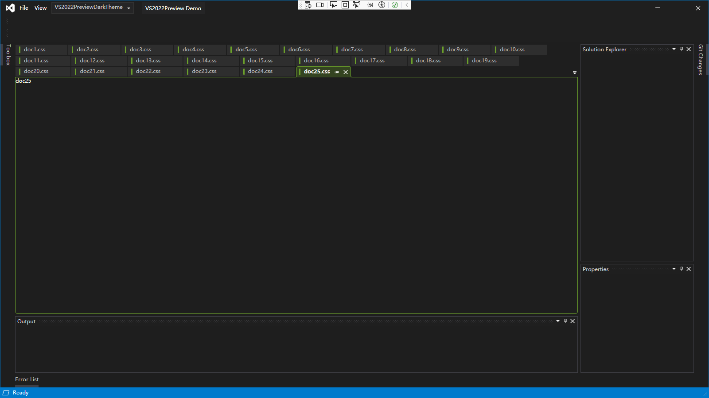
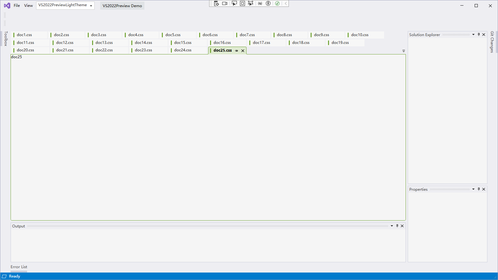
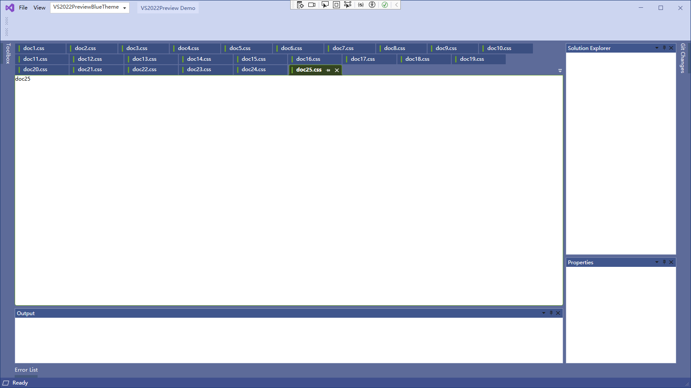

| **Version / 版本** | **🌐 English** | **🇨🇳 简体中文** |
| :--- | :---: | :---: |
| **VS2022 Preview** | [English](readme.md) | 🚀 **简体中文** |
| **VS2022** | [English](readme_VS2022.md) | [简体中文](readme-zh_CN_VS2022.md) |

---

| Downloads                                                                                                                                               | NuGet Packages
| :------------------------------------------------------------------------------------------------------------------------------------------------------ | :--------------------------------------------------------------------------------
| [](http://nuget.org/packages/Dirkster.AvalonDock)                                      | [Dirkster.AvalonDock](http://nuget.org/packages/Dirkster.AvalonDock)
| [](http://nuget.org/packages/Dirkster.AvalonDock.Themes.Aero)              | [Dirkster.AvalonDock.Themes.Aero](http://nuget.org/packages/Dirkster.AvalonDock.Themes.Aero)
| [](http://nuget.org/packages/Dirkster.AvalonDock.Themes.Expression)  | [Dirkster.AvalonDock.Themes.Expression](http://nuget.org/packages/Dirkster.AvalonDock.Themes.Expression)
| [](http://nuget.org/packages/Dirkster.AvalonDock.Themes.Metro)            | [Dirkster.AvalonDock.Themes.Metro](http://nuget.org/packages/Dirkster.AvalonDock.Themes.Metro)
| [](http://nuget.org/packages/Dirkster.AvalonDock.Themes.VS2010)          | [Dirkster.AvalonDock.Themes.VS2010](http://nuget.org/packages/Dirkster.AvalonDock.Themes.VS2010)
| [](http://nuget.org/packages/Dirkster.AvalonDock.Themes.VS2013)          | [Dirkster.AvalonDock.Themes.VS2013](http://nuget.org/packages/Dirkster.AvalonDock.Themes.VS2013) (see [Wiki](https://github.com/Dirkster99/AvalonDock/wiki/WPF-VS-2013-Dark-Light-Demo-Client) )
| [](https://www.nuget.org/packages/ML592.AvalonDock.Themes.VS2022)          | [ML592.AvalonDock.Themes.VS2022](https://www.nuget.org/packages/ML592.AvalonDock.Themes.VS2022)
| [](https://www.nuget.org/packages/ML592.AvalonDock.Themes.VS2022Preview)          | [ML592.AvalonDock.Themes.VS2022Preview](https://www.nuget.org/packages/ML592.AvalonDock.Themes.VS2022Preview)

   

## Contributors

<a href="https://github.com/MLing592" target="_blank"></a>
<a href="https://github.com/wittybaji" target="_blank"></a>

# 功能：相较于原版增加了VS2022Preview主题
1. 文档标签支持固定，固定项与非固定项分行放置
2. 文档标签支持多行显示，自适应流式换行
3. 文档标签支持设置选项卡颜色,优化了衔接UI
4. 文档内容支持框选色跟随选项卡颜色
5. 文档标签支持一键关闭左侧标签，一键关闭左侧标签除固定项外，一键关闭右侧标签，一键关闭右侧标签除固定项外，除此之外全部关闭，关闭所有...

### VS2022PreviewTest

<table width="100%">
   <tr>
      <td>theme</td>
      <td>display</td>
   </tr>
   <tr>
      <td>Dark</td>
      <td></td>
   </tr>
   <tr>
      <td>Light</td>
      <td></td>
   </tr>
   <tr>
      <td>Blue</td>
      <td></td>
   </tr>
</table>


## Theming

使用时需要在App.xaml中添加如下资源到资源字典，可以任选一个也可以全部添加，包括了深色，浅色，蓝色三种主题色

```XAML
    <ResourceDictionary.MergedDictionaries>
        <ResourceDictionary Source="/AvalonDock.Themes.VS2022Preview;component/DarkBrushs.xaml" />
    </ResourceDictionary.MergedDictionaries>
```

```XAML
    <ResourceDictionary.MergedDictionaries>
        <ResourceDictionary Source="/AvalonDock.Themes.VS2022Preview;component/LightBrushs.xaml" />
    </ResourceDictionary.MergedDictionaries>
```

```XAML
    <ResourceDictionary.MergedDictionaries>
        <ResourceDictionary Source="/AvalonDock.Themes.VS2022Preview;component/BlueBrushs.xaml" />
    </ResourceDictionary.MergedDictionaries>
```

可以使用一些标准的主题库来进行管理，例如：
- [MahApps.Metro](https://github.com/MahApps/MahApps.Metro),
- [MLib](https://github.com/Dirkster99/MLib), or
- [MUI](https://github.com/firstfloorsoftware/mui)

这可以帮助你将控件都根据主题进行变换，例如button，textBlock等。

# 简单使用这个库

1. 在nuget中搜索并下载安装如下包: ML592.AvalonDock.Themes.VS2022Preview, 依赖于ML592.AvalonDock,暂未发布nuget包

2. 在 App.xaml 中添加以下代码:

 ```XAML
     <Application.Resources>
        <ResourceDictionary>
            <ResourceDictionary.MergedDictionaries>
                <ResourceDictionary Source="/AvalonDock.Themes.VS2022Preview;component/DarkBrushs.xaml" />
                <ResourceDictionary Source="/AvalonDock.Themes.VS2022Preview;component/LightBrushs.xaml" />
                <ResourceDictionary Source="/AvalonDock.Themes.VS2022Preview;component/BlueBrushs.xaml" />
            </ResourceDictionary.MergedDictionaries>
        </ResourceDictionary>
    </Application.Resources>
```

3. 在 MainWindow.xaml 中添加以下代码：

```
    <Grid>
        <DockingManager>
            <DockingManager.Theme>
                <VS2022PreviewDarkTheme />
            </DockingManager.Theme>
            <LayoutRoot>
                <LayoutPanel Orientation="Horizontal">
                    <LayoutPanel Orientation="Vertical">
                        <LayoutDocumentPane>
                            <LayoutDocument Title="doc1" Content="doc1" ContentId="doc1" />
                            <LayoutDocument Title="doc2" Content="doc2" ContentId="doc2" />
                            <LayoutDocument Title="doc3" Content="doc3" ContentId="doc3" />
                            <LayoutDocument Title="doc4" Content="doc4" ContentId="doc4" />
                            <LayoutDocument Title="doc5" Content="doc5" ContentId="doc5" />
                            <LayoutDocument Title="doc6" Content="doc6" ContentId="doc6" />
                            <LayoutDocument Title="doc7" Content="doc7" ContentId="doc7" />
                            <LayoutDocument Title="doc8" Content="doc8" ContentId="doc8" />
                            <LayoutDocument Title="doc9" Content="doc9" ContentId="doc9" />
                            <LayoutDocument Title="doc10" Content="doc10" ContentId="doc10" />
                            <LayoutDocument Title="doc11" Content="doc11" ContentId="doc11" />
                            <LayoutDocument Title="doc12" Content="doc12" ContentId="doc12" />
                            <LayoutDocument Title="doc13" Content="doc13" ContentId="doc13" />
                            <LayoutDocument Title="doc14" Content="doc14" ContentId="doc14" />
                            <LayoutDocument Title="doc15" Content="doc15" ContentId="doc15" />
                            <LayoutDocument Title="doc16" Content="doc16" ContentId="doc16" />
                            <LayoutDocument Title="doc17" Content="doc17" ContentId="doc17" />
                            <LayoutDocument Title="doc18" Content="doc18" ContentId="doc18" />
                            <LayoutDocument Title="doc19" Content="doc19" ContentId="doc19" />
                            <LayoutDocument Title="doc20" Content="doc20" ContentId="doc20" />
                            <LayoutDocument Title="doc21" Content="doc21" ContentId="doc21" />
                            <LayoutDocument Title="doc22" Content="doc22" ContentId="doc22" />
                            <LayoutDocument Title="doc23" Content="doc23" ContentId="doc23" />
                            <LayoutDocument Title="doc24" Content="doc24" ContentId="doc24" />
                            <LayoutDocument Title="doc25" Content="doc25" ContentId="doc25" />
                        </LayoutDocumentPane>

                        <LayoutAnchorablePaneGroup DockHeight="128" Orientation="Horizontal">
                            <LayoutAnchorablePane Name="ErrorsPane" />
                            <LayoutAnchorablePane Name="OutputPane" />
                        </LayoutAnchorablePaneGroup>
                    </LayoutPanel>

                    <LayoutAnchorablePaneGroup DockWidth="256" Orientation="Vertical">
                        <LayoutAnchorablePane Name="ExplorerPane" DockHeight="2*" />
                        <LayoutAnchorablePane Name="PropertiesPane" />
                    </LayoutAnchorablePaneGroup>
                </LayoutPanel>
            </LayoutRoot>
        </DockingManager>
    </Grid>
```

4.感谢，用法与它一致： [Dikster99 AvalonDock 4.72.0](https://github.com/Dirkster99/AvalonDock/tree/v4.72.0).


